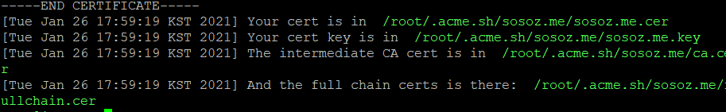
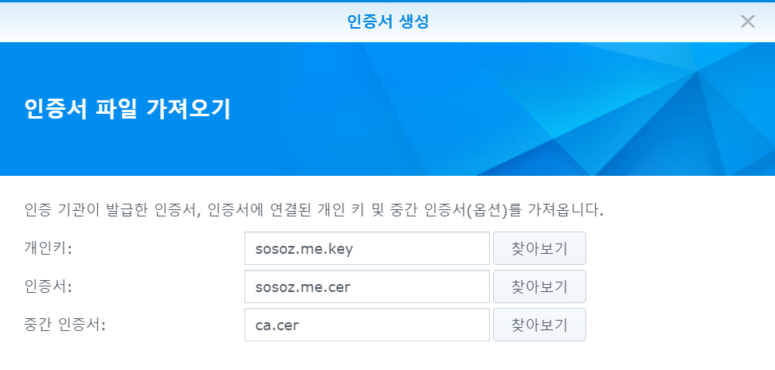

## Let's Encrypt SSL 인증서 적용

DNS Manual mode 등록하는 순서를 정리합니다.

### 인증서 설치 및 발급

1. Synology nas에 SSH로 연결합니다.

```bash
$ ssh user@192.168.0.100 -p 22
```

2. acme.sh 설치

```bash
sudo -i
cd /var/services/homes/ten/
git clone https://github.com/acmesh-official/acme.sh.git
cd acme.sh
./acme.sh --install -m  my@example.com --force
```

3. 인증서 발급

```bash
$ ~/.acme.sh/acme.sh --issue -d sosoz.me --dns -d *.sosoz.me --force --yes-I-know-dns-manual-mode-enough-go-ahead-please --server letsencrypt
```

4. 도메인서버에 Domain 과 TXT Value 값을 복사하여 DNS 레코드에 TXT 레코드로 추가합니다.

5. DNS TXT 레코드 변경 후 발급된 TXT Value와 일치하는지 확인합니다. 통상 1~2분이면 확인됩니다.

```bash
$ nslookup
$ set type=txt
$ _acme-challenge.sosoz.me
```

6. 인증서 갱신 명령어를 입력하여 인증서를 발급을 마무리합니다.

```bash
$ ~/.acme.sh/acme.sh --renew -d sosoz.me --dns -d *.sosoz.me --force --yes-I-know-dns-manual-mode-enough-go-ahead-please --server letsencrypt
```



> **NOTE:** 발급이 완료되면 /root/.acme.sh/[domain]/ 경로 아래에 4개의 파일이 생성됩니다.

### 발급된 인증서 Synology NAS 인증서로 추가

1. 시놀로지 나스에 SSH로 연결하여 인증서를 다운받기 위해 임시 폴더를 만듭니다.

```bash
cd /var/services/homes/user/
mkdir cert
cd cert
```

2. 관리자로 로그인하고 발급된 인증서를 임시 폴더로 복사합니다.

```bash
sudo -i
cp /root/.acme.sh/sosoz.me/sosoz.me.cer .
cp /root/.acme.sh/sosoz.me/ca.cer .
cp /root/.acme.sh/sosoz.me/fullchain.cer .
cp /root/.acme.sh/sosoz.me/sosoz.me.key .
```

> **NOTE:** 파일 탐색기에서는 인증서가 발급된 /root/.acme.sh/[domain] 으로 접근할 수 없으니 인증서를 복사해야 합니다.

3. 시놀로지 DSM에 로그인하여 파일 스테이션을 실행합니다.
4. 임시폴더에서 복사된 파일을 다운로드 받습니다.
5. 다운로드 받은 인증서를 DSM 제어판 - 보안 - 인증서에 추가하고 기본 인증서로 지정합니다.
   
6. 인증서를 선택하고 `구성`을 클릭 후 서비스 별 인증서를 모두 기본인증서로 변경합니다.

### 인증서 자동갱신을 위해 스케줄러에 작업 추가

1. 우선, 기본으로 지정한 인증서가 저장되는 경로를 확인합니다.

```bash
cat /usr/syno/etc/certificate/_archive/DEFAULT
```

2. 위 명령어 실행후에 반환되는 코드 6자리를 복사합니다.
3. 제어판 - 작업 스케줄러를 실행합니다. 생성 - 예약된 작업 - 사용자 정의 스크립트를 추가합니다.
   > **NOTE:** 사용자는 root로 지정해야 합니다.
   > **NOTE:** Reverse Proxy 는 자동 적용되지 않아서 개별적으로 적용해야 합니다.\_
4. 작업 설정탭에 사용자 정의 스크립트에 아래 내용을 복사하고 앞서 확인된 코드 6자리를 복사해서 내용을 수정합니다.

```bash
# 인증서 갱신
/root/.acme.sh/acme.sh --renew -d sosoz.me --dns -d *.sosoz.me --force --yes-I-know-dns-manual-mode-enough-go-ahead-please --server letsencrypt

# 인증서 등록
# 복사할 폴더 확인 cat /usr/syno/etc/certificate/_archive/DEFAULT 명령후 출력되는 6자리 코드로 수정합니다.
cp /root/.acme.sh/sosoz.me/sosoz.me.cer /usr/syno/etc/certificate/_archive/i7b3hd/cert.pem
cp /root/.acme.sh/sosoz.me/ca.cer /usr/syno/etc/certificate/_archive/i7b3hd/chain.pem
cp /root/.acme.sh/sosoz.me/fullchain.cer /usr/syno/etc/certificate/_archive/i7b3hd/fullchain.pem
cp /root/.acme.sh/sosoz.me/sosoz.me.key /usr/syno/etc/certificate/_archive/i7b3hd/privkey.pem

# reverse proxy 에 적용
for reverse in `ls -l /usr/syno/etc/certificate/ReverseProxy/ | grep "^d" | awk '{ print $9 }'`; do cp -f /root/.acme.sh/sosoz.me/sosoz.me.cer /usr/syno/etc/certificate/ReverseProxy/$reverse/cert.pem; cp -f /root/.acme.sh/sosoz.me/ca.cer /usr/syno/etc/certificate/ReverseProxy/$reverse/chain.pem; cp -f /root/.acme.sh/sosoz.me/fullchain.cer /usr/syno/etc/certificate/ReverseProxy/$reverse/fullchain.pem; cp -f /root/.acme.sh/sosoz.me/sosoz.me.key /usr/syno/etc/certificate/ReverseProxy/$reverse/privkey.pem; done


# nginx 재시작
/usr/syno/sbin/synoservicectl --reload nginx
```
